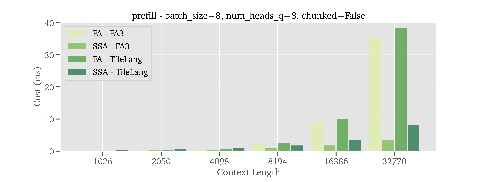
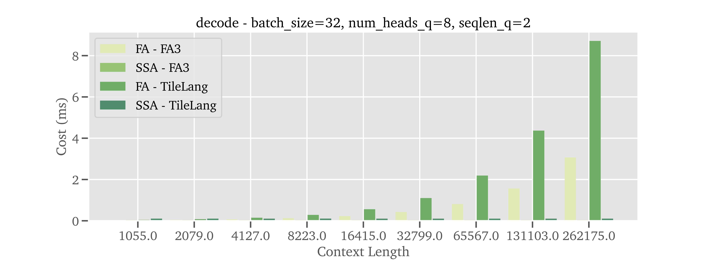

# LongCat-Flash-Thinking-ZigZag

<div align="center">
  
</div>
<hr>


<div align="center" style="line-height: 1;">
  <a href="https://longcat.ai/" target="_blank" style="margin: 2px;">
    
  </a>
  <a href="https://huggingface.co/meituan-longcat" target="_blank" style="margin: 2px;">
    
  </a>
  <a href="https://www.modelscope.cn/models/meituan-longcat" target="_blank" style="margin: 2px;">
    
  </a>
</div>

<div align="center" style="line-height: 1;">
  <a href="https://github.com/meituan-longcat/LongCat-Flash-Thinking-2601/blob/main/figures/wechat_official_accounts.png" target="_blank" style="margin: 2px;">
    
  </a>
  <a href="https://x.com/Meituan_LongCat" target="_blank" style="margin: 2px;">
    
  </a>
  <a href="https://arxiv.org/abs/2512.23966" target="_blank" style="margin: 2px;">
    
  </a>
</div>

<div align="center" style="line-height: 1;">
  <a href="https://huggingface.co/meituan-longcat/LongCat-Flash-Thinking-ZigZag/blob/main/LICENSE" style="margin: 2px;">
    
  </a>
</div>

<hr>
<div align="center" style="line-height: 1;">
  
</div>


## Updates

* [2026.1.28] We have provided the TileLang kernels supporting prefill (chunked-prefill as well) and decode (multi-token prediction as well). The full attention version is placed at [flash_mla_interface.py](flash_mla_interface.py) while the streaming sparse attention version is placed at [streaming_sparse_attn_interface.py](streaming_sparse_attn_interface.py). Basic usage is offered in the following code snippet:

```python
from flash_mla_interface import flash_mla_varlen_func, flash_mla_with_kvcache
from streaming_sparse_attn_interface import streaming_sparse_attn_varlen_func, streaming_sparse_attn_with_kvcache


full_attn_out = flash_mla_varlen_func_(
    q, # [nnz_q, num_heads_q, head_dim_qk]
    k, # [nnz_k, num_heads_k, head_dim_qk]
    v, # [nnz_k, num_heads_v, head_dim_vo]
    cu_seqlens_q,
    cu_seqlens_k,
    max_seqlen_q,
    max_seqlen_k,
    softmax_scale,
    causal=True
)
stream_attn_out = streaming_sparse_attn_varlen_func_(
    q,
    k,
    v,
    cu_seqlens_q,
    cu_seqlens_k,
    max_seqlen_q,
    max_seqlen_k,
    softmax_scale,
    causal=True
)
        

full_attn_out = flash_mla_with_kvcache(
    q, # [batch_size, seqlen_q, num_heads_q, head_dim_nope + head_dim_rope]
    blocked_k, # [num_pages, page_size, num_heads_k, head_dim_nope + head_dim_rope]
    cache_seqlens,
    block_table,
    head_dim_nope, 
    softmax_scale,
    causal=True
)
stream_attn_out = streaming_sparse_attn_with_kvcache(
    q,
    blocked_k,
    cache_seqlens,
    block_table,
    head_dim_nope,
    softmax_scale,
    causal=True
)
```

Benchmarking performance as below:

<hr>
<div align="center" style="line-height: 1;">
  
</div>
<div align="center" style="line-height: 1;">
  
</div>


## Model Introduction

Along with LongCat-Flash-Thinking-2601, we introduce an efficient alternative termed LongCat-Flash-Thinking-ZigZag. LongCat-Flash-Thinking-ZigZag is nothing different from LongCat-Flash-Thinking-2601 except that it is further enhanced by LongCat ZigZag Attention (LoZA). LoZA is essentially a sparse attention scheme designed to transform any existing full-attention models into sparse versions with rather limited compute budget. In long-context scenarios, LoZA can achieve significant speed-ups both for prefill-intensive (e.g., retrieval-augmented generation) and decode-intensive (e.g., tool-integrated reasoning) cases.
Specifically, by diverging LongCat-Flash-Thinking-ZigZag from LongCat-Flash-Thinking-2601 during mid-training using LoZA, we serve LongCat-Flash-Thinking-ZigZag as a long-context foundation model that can swiftly process a long range of tokens, enabling efficient long-term reasoning and long-horizon agentic capabilities.


### Key Features

#### 🧮 Limited Compute Overhead

LongCat ZigZag Attention (LoZA) firstly uncovers the layers that can be sparsified without hurting much performance, secondly sparsifies the layers that can be further trained to close performance gap. The whole process behaves very much like what has been described in *lottery tickets hypothesis*. In theory, a mid-trained LM is sequentially sparsified, rewound, mid-trained to maximally recover the full performance. In other words, the calibration starts at the end of mid-training while the training starts at the beginning of the mid-training, resulting in rather marginal compute overhead compared to training from scratch.

#### 📈 Efficient Context Scaling

LoZA enables 50\% sparsity in LongCat-Flash-Thinking-ZigZag, the compute brought by attention should be ideally reduced by a factor of 2. For long-context circumstances where attention dominates the compute, the efficiency could be maximally lifted to 2 times of the original. Promoted by our efforts in kernel and engine customizations, in Figure below, the streaming sparse attention kernel could minimally use 90\% less cost in decode compared to full attention kernel (i.e., FlashMLA) for a context of 128K tokens. Meanwhile, in end-to-end benchmarking, LongCat-Flash-Thinking-ZigZag realizes more than 50\% speed-up in prefill and saves over 30\% cost in decode for a context of 256K tokens.

<hr>
<div align="center" style="line-height: 1;">
   
</div> <br>
<div style="display: flex; justify-content: center; gap: 10px;">
  
  
</div>

#### 🔝 Competitive Benchmark Performance

LoZA would not compromise quality for speed. On the concerned benchmarks, LongCat-Flash-Thinking-ZigZag exhibit competitive performance with LongCat-Flash-Thinking-2601. Concretely, LongCat-Flash-Thinking-ZigZag also stands at the same line with other competitors such like DeepSeek-V3.2. And considerable cost savings are also achieved across a diverse range of benchmarks as shown in Figure below.

<hr>
<div align="center" style="line-height: 1;">
  
</div>

## Evaluation Results

| **Benchmark** | DeepSeek-V3.2-Thinking | Kimi-K2-Thinking | Qwen3-235B-A22B-Thinking-2507 | GLM-4.7-Thinking | Claude-Opus-4.5-Thinking | Gemini-3-Pro | GPT-5.2-Thinking-xhigh | LongCat-Flash-Thinking-2601 | LongCat-Flash-Thinking-ZigZag |
|---------------|------------------------|------------------|-------------------------------|------------------|---------------------------|--------------|------------------------|------------------------------|------------------------------|
| Architecture | MoE | MoE | MoE | MoE | - | - | - | MoE | MoE |
| Sparse Attention | ✅ | ❌ | ❌ | ❌ | - | - | - | ❌ | ✅ |
| # Total Params | 671B | 1T | 235B | 355B | - | - | - | 560B |
| # Activated Params | 37B | 32B | 22B | 32B | - | - | - | 27B |
| **Mathematical Reasoning w/ Tools** | | | | | | | | |
| AIME-25 (Avg@16) | 93.5* | 99.1† | 92.6* | 95.3* | **100.0** | 99.8 | **100.0** | <u>99.6</u> / **100.0**‡ | 99.2 / - |
| HMMT-25 (Avg@16) | 93.5* | 95.1† | 83.9* | <u>98.1</u>* | 98.6 | **99.8** | 99.6 | 93.4 / 97.5‡ | 93.5 / - |
| AMO-Bench EN (Avg@16) | 51.9* | 56.0* | 47.8* | 62.4* | <u>66.0</u> | **72.5** | - | 61.6 / <u>66.0</u>‡ | 60.4 / - |
| AMO-Bench CH (Avg@16) | 52.0* | 51.8* | 28.8* | 35.1* | 67.7 | **74.9** | - | 56.8 / <u>67.5</u>‡ | 58.3 / - |
| **Agentic Search** | | | | | | | | |
| BrowseComp (Pass@1) | 51.4 / <u>67.6</u>† | - / 60.2† | - | 52.0 / 67.5† | - | - | 65.8 / - | 56.6 / **73.1** | 55.2 / - |
| BrowseComp-zh (Pass@1) | 65.0 / - | - / 62.3† | - | 66.6 / - | - | - | - | <u>69.0</u> / **77.7** | 71.9 / - |
| **Agentic Tool Using** | | | | | | | | |
| τ²-Retail (Avg@4) | 81.8† | - | 71.9† | - | **88.9**† | - | 82.0† | <u>88.6</u> | 86.8 |
| τ²-Airline (Avg@4) | <u>63.8</u>† | - | 58.6† | - | - | - | - | **76.5** | **76.5** |
| τ²-Telecom (Avg@4) | 96.2† | - | 47.3 | - | 98.2† | - | <u>98.7</u>† | **99.3** | 97.4 |
| τ²-Avg (Avg@4) | 80.6 | 74.3† | 59.3 | 87.4† | 82.4 | **90.7**† | 80.6 | <u>88.2</u> | 86.9 |
| **General QA** | | | | | | | | |
| HLE text-only (w/o tools) | 24.1 | 24.4 | 17.8 | <u>26.9</u> | 32.0 | **40.3** | 34.5† | 25.2 | 25.8 |
| GPQA-Diamond (Avg@16) | <u>86.9</u> | 85.4 | 80.5 | 84.9 | 86.9 | 91.9 | **92.9** | 80.5 / 85.2‡ | 80.6 / - |
| **Coding** | | | | | | | | |
| LCB (24.08–25.05) (Avg@4) | 82.4 | 75.1 | 76.2 | <u>84.8</u> | 82.8 | **88.1** | - | 82.8 | 81.7 |
| OJBench (Pass@1) | 41.8 | 42.3 | 35.6 | <u>44.6</u> | 46.7 | **61.2** | - | 42.2 | 41.2 |

Note:
- Values marked with † are sourced from other public reports.
- ‡ indicates the score obtained using our Heavy Thinking mode.
- \* indicates that the result with tools is unavailable, and thus the corresponding result without tools is reported instead.
- For BrowseComp-zh, due to a high error rate in the original annotations, we manually revised the answers for 24 cases.
- For the τ²-Airline domain, we adopt the fixes to the environment as proposed in the Claude Opus 4.5 release report.
- For BrowseComp, performance is reported both without and with the context management technique.


## Quick Start

### Chat Template Overview

To support advanced tool-use scenarios and sophisticated reasoning paradigms, we have introduced significant updates to our chat template, as defined in the `tokenizer_config.json` file. 

#### Basic Usage
The chat template can be applied using the ```apply_chat_template``` method. Below is a standard implementation:

```python
text = tokenizer.apply_chat_template(
    messages,
    tools=tools,
    tokenize=False,
    enable_thinking=True,
    add_generation_prompt=True,
    save_history_reasoning_content=False
)
```

#### Key Features
*   **Tool Declaration:** Available tools are declared at the beginning of the session to activate the model's tool-use capabilities and define the scope of available actions.
*   **Interleaved Thinking:** By default, the template employs an interleaved thinking approach. In this mode, the final response is preserved while thinking content from previous user interactions is discarded to maintain a concise context window. Tool calls and responses are retained to provide necessary execution history.
*   **Reasoning Retention:** If you need to preserve the model's thinking content across turns, you can enable this by setting `save_history_reasoning_content=True`.

#### Implementation Examples

##### 1. Multi-Turn Dialogue
This example demonstrates how the template handles conversational history and thinking content.

```python
from transformers import AutoModelForCausalLM, AutoTokenizer

model_name = "meituan-longcat/LongCat-Flash-Thinking-ZigZag"

# Load the tokenizer and the model
tokenizer = AutoTokenizer.from_pretrained(model_name)

messages = [
    {"role": "system", "content": "You are a helpful assistant."},
    {"role": "user", "content": "Please tell me what is $$1 + 1$$ and $$2 \times 2$$?"},
    {"role": "assistant", "reasoning_content": "This question is straightforward: $$1 + 1 = 2$$ and $$2 \times 2 = 4$$.", "content": "The answers are 2 and 4."},
    {"role": "user", "content": "Check again?"}
]

text = tokenizer.apply_chat_template(
    messages,
    tokenize=False,
    enable_thinking=True,
    add_generation_prompt=True,
    save_history_reasoning_content=False # Discard reasoning history to save tokens
)

# Template Output Structure:
# <longcat_system>You are a helpful assistant.<longcat_user>Please tell me what is $$1 + 1$$ and $$2 \times 2$$?<longcat_assistant>The answers are 2 and 4</longcat_s><longcat_user>Check again? /think_on <longcat_assistant><longcat_think>\n

model_inputs = tokenizer([text], return_tensors="pt").to(model.device)

# Generate response
generated_ids = model.generate(
    **model_inputs,
    max_new_tokens=32768
)
output_ids = generated_ids[0][len(model_inputs.input_ids[0]):].tolist() 

print(tokenizer.decode(output_ids, skip_special_tokens=True).strip("\n"))

# Example Output:
# The user wants a double-check. Since $$1 + 1 = 2$$ and $$2 \times 2 = 4$$ are basic arithmetic truths, the previous answer is correct.\n</longcat_think>\nI have verified the calculations: $$1 + 1 = 2$$ and $$2 \times 2 = 4$$. The initial answer remains correct.</longcat_s>
```

##### 2. Tool Calling
This example illustrates how to integrate function calling within the reasoning framework.


```python
tools = [
    {
        "type": "function",
        "function": {
            "name": "func_add",
            "description": "Calculate the sum of two numbers",
            "parameters": {
                "type": "object",
                "properties": {
                    "x1": {"type": "number", "description": "The first addend"},
                    "x2": {"type": "number", "description": "The second addend"}
                },
                "required": ["x1", "x2"]
            }
        }
    }
]

messages = [
    {"role": "system", "content": "You are a helpful assistant."},
    {"role": "user", "content": "Please tell me what is $$125679 + 234519$$?"},
    {
        "role": "assistant", 
        "reasoning_content": "This calculation requires precision; I will use the func_add tool.", 
        "tool_calls": [{"type": "function", "function": {"name": "func_add", "arguments": {"x1": 125679, "x2": 234519}}}]
    },
    {"role": "tool", "name": "func_add", "content": '{"ans": 360198}'}
]

text = tokenizer.apply_chat_template(
    messages,
    tools=tools,
    tokenize=False,
    enable_thinking=True,
    add_generation_prompt=True,
    save_history_reasoning_content=False
)

model_inputs = tokenizer([text], return_tensors="pt").to(model.device)

# Generate response based on tool result
generated_ids = model.generate(
    **model_inputs,
    max_new_tokens=32768
)
output_ids = generated_ids[0][len(model_inputs.input_ids[0]):].tolist() 

print(tokenizer.decode(output_ids, skip_special_tokens=True).strip("\n"))
```

## Deployment

We have implemented basic adaptations in SGLang ([PR](https://github.com/sgl-project/sglang/pull/18093)) to support the deployment of LongCat-Flash-Thinking-ZigZag.

P.S. a reference streaming sparse attention prefill kernel in tilelang has been made available in [modeling_longcat.py](https://huggingface.co/meituan-longcat/LongCat-Flash-Thinking-ZigZag/blob/main/modeling_longcat.py#L504).

### Single-Node

```bash
python3 -m sglang.launch_server \
    --model meituan-longcat/LongCat-Flash-Thinking-ZigZag \
    --trust-remote-code \
    --attention-backend zigzag_attn \
    --enable-ep-moe \
    --tp 8
```

### Multi-Node

```bash
python3 -m sglang.launch_server \
    --model meituan-longcat/LongCat-Flash-Thinking-ZigZag \
    --trust-remote-code \
    --attention-backend zigzag_attn \
    --enable-ep-moe \
    --tp 16 \
    --nnodes 2 \
    --node-rank $NODE_RANK \
    --dist-init-addr $MASTER_IP:5000
```

> [!Note]
> Replace $NODE_RANK and $MASTER_IP with the specific values for your cluster.


## Chat Website

You can chat with LongCat-Flash-Thinking-2601 on our official website: [https://longcat.ai](https://longcat.ai).
Please turn on the button "Think" ("深度思考" in Chinese) before submitting your request.


## License Agreement

The **model weights** are released under the **MIT License**. 

Any contributions to this repository are licensed under the MIT License, unless otherwise stated. This license does not grant any rights to use Meituan trademarks or patents. 

See the [LICENSE](LICENSE) file for the full license text.

## Usage Considerations 

This model has not been specifically designed or comprehensively evaluated for every possible downstream application. 

Developers should take into account the known limitations of large language models, including performance variations across different languages, and carefully assess accuracy, safety, and fairness before deploying the model in sensitive or high-risk scenarios. 
It is the responsibility of developers and downstream users to understand and comply with all applicable laws and regulations relevant to their use case, including but not limited to data protection, privacy, and content safety requirements. 

Nothing in this Model Card should be interpreted as altering or restricting the terms of the MIT License under which the model is released. 

## Contact

Please contact us at <a href="mailto:longcat-team@meituan.com">longcat-team@meituan.com</a> or join our WeChat Group if you have any questions.

#### WeChat Group


